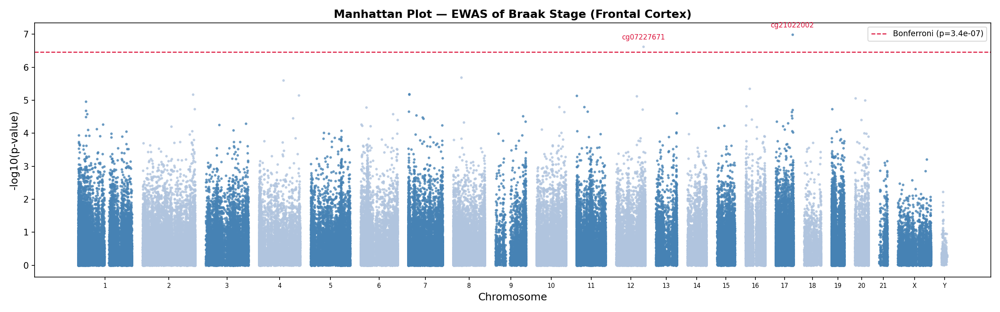
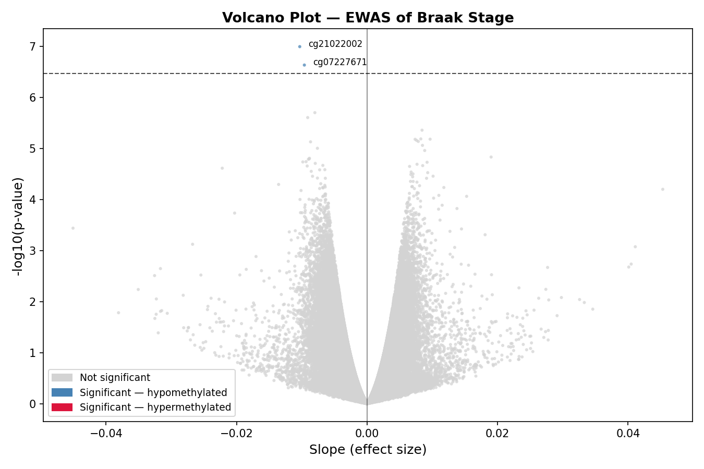
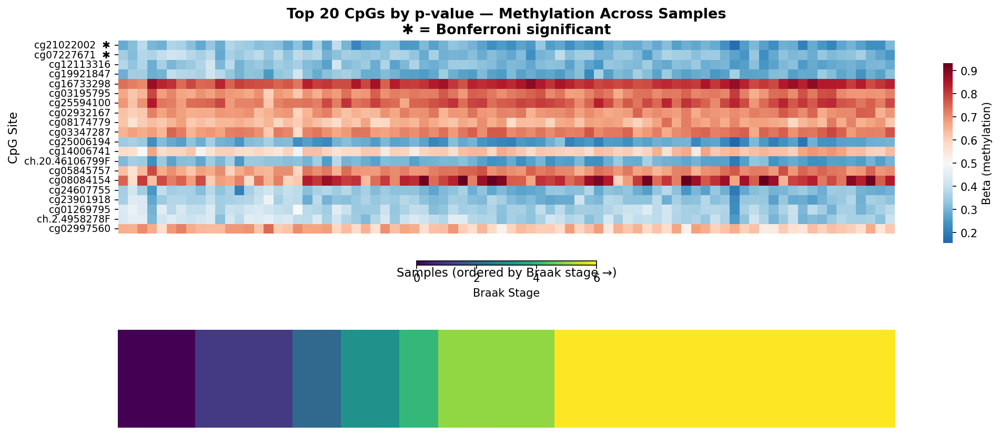
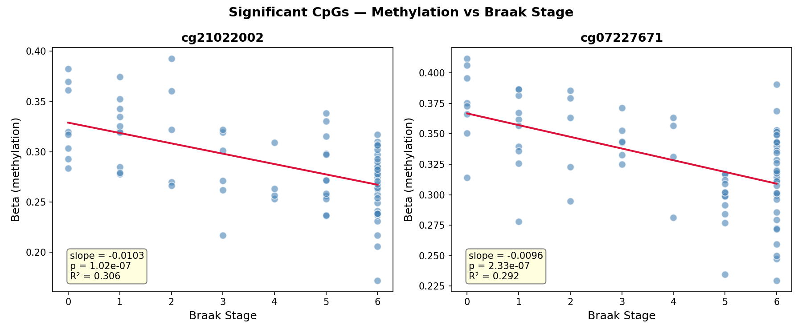
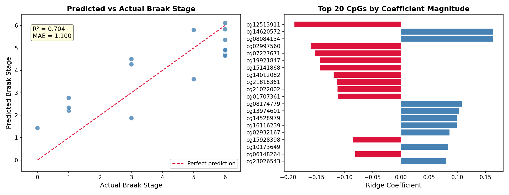

# Alzheimers-methylation-ewas

# Alzheimer's Disease EWAS — DNA Methylation and Braak Stage

An epigenome-wide association study (EWAS) of DNA methylation in human frontal
cortex tissue, testing whether methylation at 145,089 CpG sites is associated
with Alzheimer's disease pathology severity (Braak stage). Built with PySpark,
scikit-learn, and Python.



---

## Summary

- **Dataset:** GSE59685 (GEO/NCBI) — Illumina 450k array, post-mortem brain tissue
- **Samples:** 80 frontal cortex donors, Braak stage 0–6
- **CpGs tested:** 145,089 (after QC filtering)
- **Significant hits:** 2 (Bonferroni-corrected p < 3.45 × 10⁻⁷)
- **Predictive model:** Ridge regression, cross-validated R² = 0.577

Both significant CpGs show hypomethylation with increasing AD pathology,
consistent with published EWAS literature.

---

## Key Results

| CpG | Slope | P-value | R² | Direction |
|-----|-------|---------|-----|-----------|
| cg21022002 | -0.0103 | 1.02 × 10⁻⁷ | 0.306 | Hypomethylated |
| cg07227671 | -0.0096 | 2.33 × 10⁻⁷ | 0.292 | Hypomethylated |

**Predictive model (top 50 CpGs → Braak stage):**

| Metric | Value |
|--------|-------|
| Test R² | 0.704 |
| Cross-validated R² | 0.577 ± 0.196 |
| MAE | 1.10 Braak stages |

---

## Visualizations

### Manhattan Plot


### Volcano Plot


### Top CpGs Heatmap


### Significant CpG Regressions


### Model Performance


---

## Project Structure
alzheimers-methylation-ewas/
├── data/                          # gitignored — generated by scripts
│   ├── metadata_clean.csv         # 80 frontal cortex samples
│   ├── beta_matrix_full.csv       # full 485k x 531 beta matrix
│   └── beta_frontal_clean.parquet # 11.6M row long-format EWAS input
├── scripts/
│   ├── 01_download_data.py        # fetch data from GEO
│   ├── 02_preprocess_spark.py     # filter, QC, convert to Parquet
│   ├── 03_ewas_spark.py           # EWAS — 145k regressions in PySpark
│   ├── 04_model_sklearn.py        # ridge regression predictive model
│   └── 05_visualize.py            # Manhattan, volcano, heatmap
├── notebooks/
│   └── exploratory.ipynb          # data exploration and previews
├── reports/
│   └── writeup.md                 # full methods, results, discussion
├── figures/                       # all output plots
├── requirements.txt
└── README.md

---

## Reproducing This Analysis

### Requirements
- Python 3.14
- Java 17 (required for PySpark 4.x)
- ~3GB disk space for data files

### Setup
```bash
git clone https://github.com/YOUR_USERNAME/alzheimers-methylation-ewas.git
cd alzheimers-methylation-ewas
python3 -m venv venv
source venv/bin/activate
pip install -r requirements.txt
```

### Java 17 (Mac)
```bash
brew install openjdk@17
export JAVA_HOME=/opt/homebrew/opt/openjdk@17
export PATH="$JAVA_HOME/bin:$PATH"
```

### Run the pipeline
```bash
python3 scripts/01_download_data.py      # ~10 min, downloads ~500MB
python3 scripts/02_preprocess_spark.py   # ~5 min
python3 scripts/03_ewas_spark.py         # ~15 min
python3 scripts/04_model_sklearn.py      # ~30 sec
python3 scripts/05_visualize.py          # ~2 min
```

> **Note:** Data files are not committed to this repository. Running
> Script 01 will download them automatically from GEO.

---

## Technical Stack

| Tool | Purpose |
|------|---------|
| **PySpark 4.1.1** | Distributed regression across 145k CpG sites |
| **Pandas UDF** | Bridge between Spark parallelism and scipy regression |
| **scipy.stats.linregress** | Per-CpG linear regression |
| **scikit-learn RidgeCV** | Regularized predictive model with cross-validation |
| **GEOparse** | Programmatic data retrieval from NCBI GEO |
| **matplotlib / seaborn** | Manhattan plot, volcano plot, heatmap |

---

## Limitations

- 80 samples is underpowered relative to published EWAS (typically 200–1,000+)
- Braak stage 6 is overrepresented (44% of samples)
- No cell type deconvolution applied
- Significant CpGs not yet annotated to genes
- Cross-sectional design limits causal inference

See [`reports/writeup.md`](reports/writeup.md) for full discussion.

---

## Author

**Alexander Hannah, PhD**  
Computational Biologist | Data Scientist  
Seattle, WA  
[GitHub](https://github.com/hannahas) · [LinkedIn](https://linkedin.com/in/alexanderhannah)

